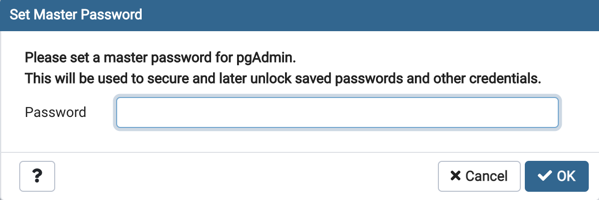
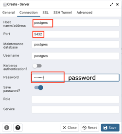
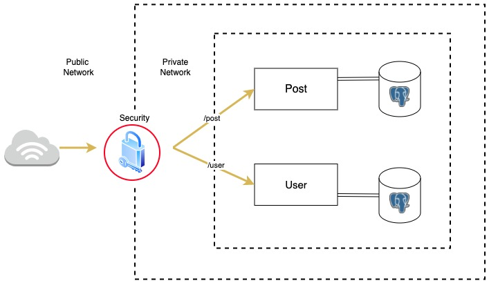
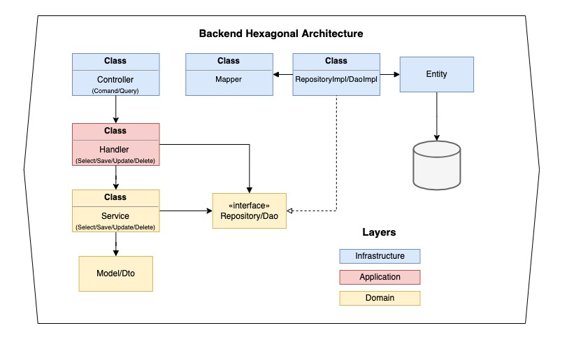
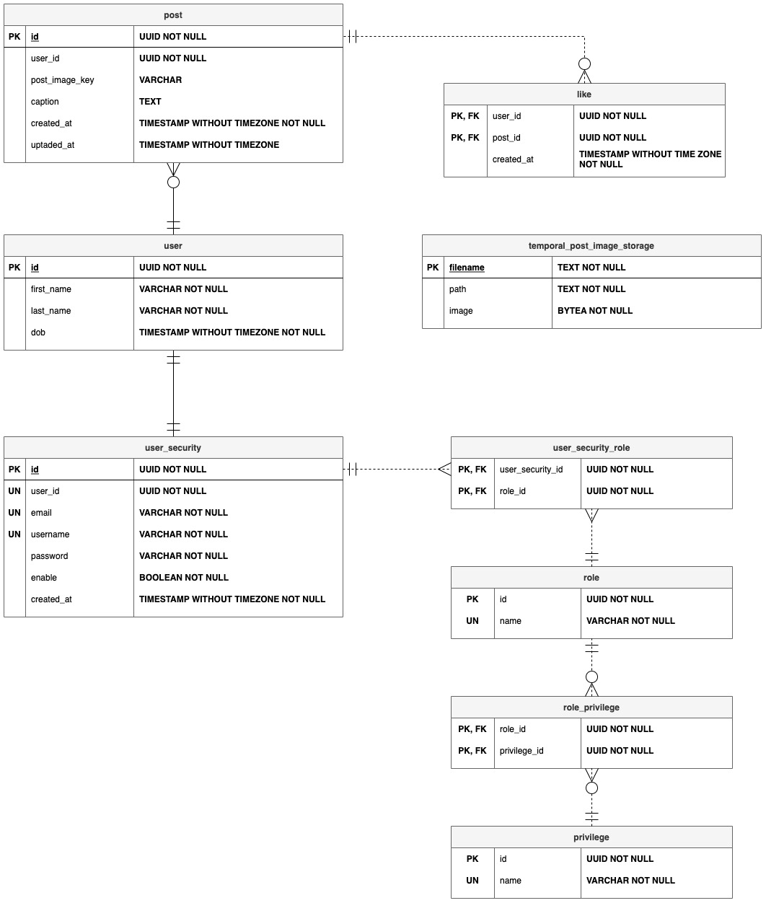

# Microservices Puppies Application

All the project was made using:

* Clean Architecture: Hexagonal Architecture or Ports and Adapters
* Java 17
* Spring Boot 2.6.2, Spring Data JPA, Spring Security JWT
* Maven version 3.8.4
* Postgres 13 Database Engine
* Docker
* Mockito and JUnit5 for testing
* IntelliJ IDEA IDE

## Prerequisites

* Install Java 17 or higher, download from this
  link [here](https://www.oracle.com/java/technologies/downloads/#jdk17-mac)
* Install Maven, download from this link [here](https://maven.apache.org/download.cgi). This article
  shows [how configure maven on Windows](https://www.mkyong.com/maven/how-to-install-maven-in-windows/)
  .
* Install Docker, download from this link [here](https://www.docker.com/get-started).

## Setup

1) Clone the project from the repository.

```
git clone git@github.com:jsneider05/microservices-puppies.git
```

```
git clone https://github.com/jsneider05/microservices-puppies.git
```

## Run the project

1) Clean, install dependencies and run the tests

```bash
cd microservices-puppies
mvn clean install -U
```

2) Start docker in your machine and run the [docker-compose.yml](docker/docker-compose.yml) file as
   follow:

Important: The ports 5434 and 5050 in your local machine must to be availables.

```bash
cd microservices-puppies/docker
docker compose up -d
```

This docker compose run two container with postgres and pgadmin instance, the last one is accesable
from http://localhost:5050/

Once you open pgadmin in your browser you need to set up a server with the following configuration

Here put whatever password you want



The server configuration



Or you can access to the postgres docker container directly like a pro:

Option 1: We can use psql to connect to Postgres container through the network, create psql
container

```bash
docker run -it --rm --network=docker_postgres postgres psql -h postgres -U postgres
```

where,

```
-it             -> interactive bash shell in the container
--rm            -> Automatically remove the container when it exits
--network       -> Connect a container to a network
--hostname , -h -> Container host name, in this case the postgres container name db
```

Option 2: Execute a bash inside the container and execute the client psql

```bash
docker exec -it postgres-db bash
```

```bash
psql -U postgres
```

In both cases the password is ```password```

For stopping the docker compose container
```bash
docker compose down
```
For cleaning the volumes created
```bash
docker volume rm $(docker volume ls -q)
```

3) Run the project as a jar: read the user and post microservice README.

* [User Microservice](user/README.md)
* [Post Microservice](post/README.md)

### General Architecture



### Microservicio Architecture




### Entity Relationship Diagram


